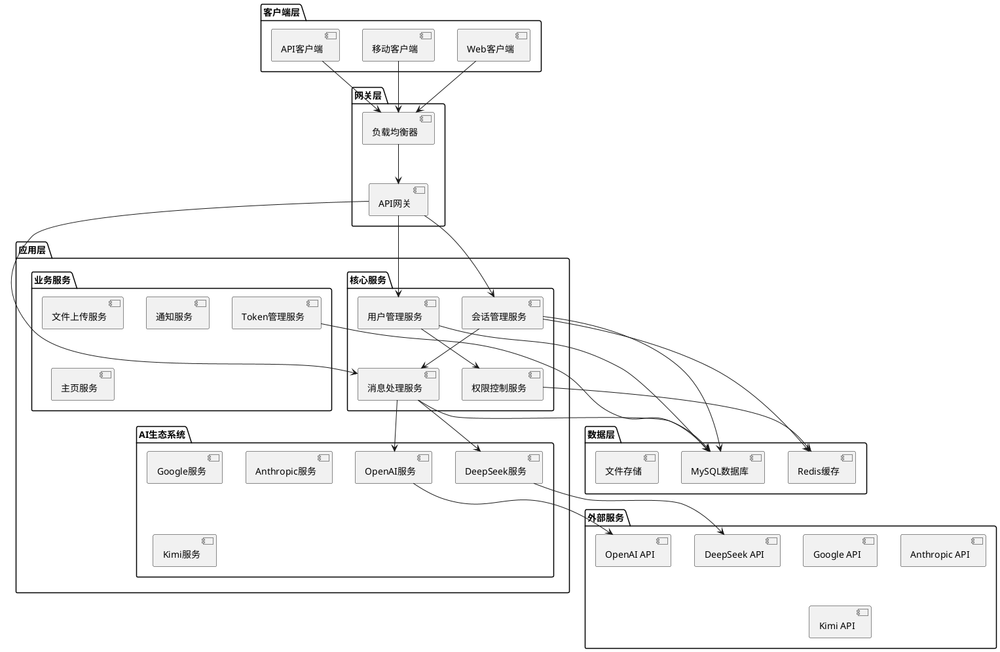
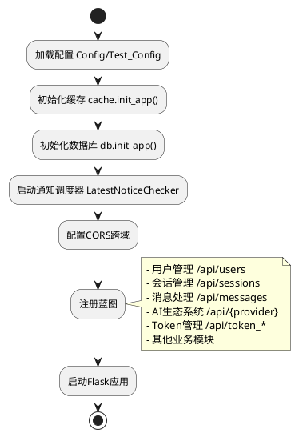
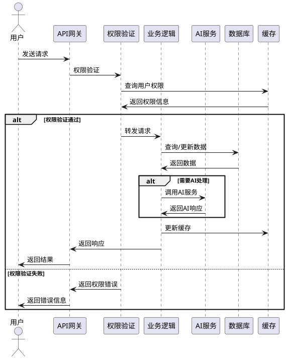
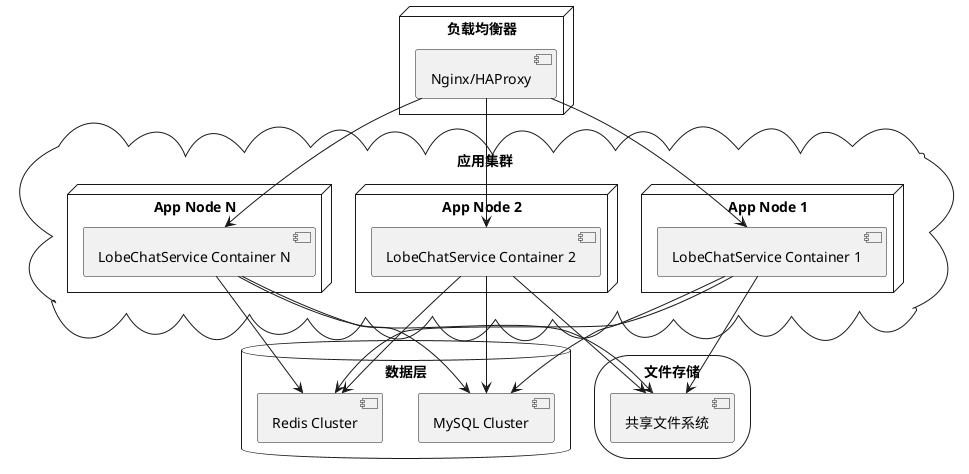

# LobeChatService 系统架构设计文档

## 1. 系统概述

LobeChatService 是一个基于 Flask 的企业级聊天服务平台，集成了多个 AI 生态系统（OpenAI、DeepSeek、Google、Anthropic、Kimi 等），为用户提供智能对话服务。系统采用微服务架构思想，通过模块化设计实现高可用、高扩展性的聊天服务。

### 1.1 核心特性

- **多AI模型集成**：支持多个主流AI服务提供商
- **用户权限管理**：基于角色的访问控制（RBAC）
- **Token管理**：完整的Token申请、分配、使用追踪机制
- **会话管理**：支持持久化会话和上下文管理
- **实时通信**：支持流式响应和实时消息推送
- **文件上传**：支持多媒体文件处理
- **通知系统**：实时消息通知和公告管理

## 2. 整体架构



## 3. 技术栈

### 3.1 后端框架
- **Flask 3.1.0**：轻量级Web框架
- **Flask-SQLAlchemy 3.1.1**：ORM数据库操作
- **Flask-Caching 2.3.1**：缓存管理
- **Flask-CORS 5.0.1**：跨域资源共享

### 3.2 数据库
- **MySQL**：主数据库（通过PyMySQL 1.1.1连接）
- **Redis**：缓存数据库

### 3.3 AI集成
- **OpenAI 1.76.0**：OpenAI模型集成
- **Anthropic 0.49.0**：Claude模型集成
- **其他**：Google、DeepSeek、Kimi等厂商API

### 3.4 其他核心库
- **Requests 2.32.3**：HTTP请求处理
- **Gunicorn**：WSGI服务器
- **Docker**：容器化部署

## 4. 核心模块架构

### 4.1 应用初始化流程



### 4.2 模块依赖关系

```plantuml
@startuml
!define COMPONENT rectangle

COMPONENT "配置模块" as Config {
  Config
  Test_Config
  CacheConfig
}

COMPONENT "数据模型" as Models {
  User_Info
  Message
  Session
  TokenBalance
  TokenApplication
  TokenUsageRecord
}

COMPONENT "路由模块" as Routes {
  用户权限路由
  会话管理路由
  消息处理路由
  AI生态系统路由
  Token管理路由
  业务功能路由
}

COMPONENT "工具模块" as Utils {
  权限工具
  日志工具
  文件上传工具
  通知调度器
  响应码定义
}

COMPONENT "安全模块" as Security {
  消息掩码
  权限验证
  访问控制
}

Config --> Models : 配置数据库连接
Models --> Routes : 提供数据操作
Utils --> Routes : 提供工具支持
Security --> Routes : 提供安全控制
Routes --> Config : 读取配置信息

@enduml
```

## 5. 数据流架构

### 5.1 用户请求处理流程



## 6. 核心服务模块

### 6.1 用户管理服务
- **功能**：用户信息管理、部门层级管理
- **核心模型**：User_Info
- **路由前缀**：`/api/users`

### 6.2 会话管理服务
- **功能**：聊天会话创建、更新、查询
- **核心模型**：Session
- **路由前缀**：`/api/sessions`

### 6.3 消息处理服务
- **功能**：消息存储、检索、处理
- **核心模型**：Message
- **路由前缀**：`/api/messages`

### 6.4 AI生态系统服务
- **支持的AI服务商**：
  - OpenAI (`/api/open_ai`)
  - DeepSeek (`/api/deepseek`)
  - Google (`/api/google`)
  - Anthropic (`/api/anthropic`)
  - Kimi (`/api/kimi`)

### 6.5 Token管理服务
- **Token余额管理**：`/api/token_balances`
- **Token申请管理**：`/api/token_applications`
- **Token使用记录**：`/api/token_usage_records`

### 6.6 权限管理服务
- **用户组管理**：`/api/user_group_api`
- **仓库权限**：`/api/v1/repo_permissions`
- **用户权限**：基于角色的访问控制

## 7. 性能和扩展性

### 7.1 缓存策略
- **Flask-Caching**：应用级缓存
- **Redis**：分布式缓存
- **数据库连接池**：SQLALCHEMY_POOL_SIZE = 500

### 7.2 异步处理
- **流式响应**：支持实时流式AI响应
- **后台任务**：通知调度器定期执行任务

### 7.3 负载均衡
- **Gunicorn**：多进程WSGI服务器
- **Docker**：容器化部署支持水平扩展

## 8. 监控和日志

### 8.1 日志系统
- **结构化日志**：使用 utils.log 模块
- **日志级别**：支持多级别日志记录
- **访问日志**：记录用户访问和操作行为

### 8.2 性能监控
- **数据库连接池监控**：实时监控连接池状态
- **API响应时间**：监控各接口性能
- **资源使用率**：CPU、内存、磁盘使用情况

## 9. 部署架构

### 9.1 容器化部署



## 10. 安全架构

### 10.1 安全层次
1. **网络安全**：HTTPS传输加密
2. **认证授权**：基于角色的权限控制
3. **数据安全**：敏感数据加密存储
4. **API安全**：请求验证和限流
5. **内容安全**：消息内容过滤和掩码

### 10.2 权限模型
- **用户（User）**：系统使用者
- **组（Group）**：用户组织结构
- **角色（Role）**：权限集合
- **权限（Permission）**：具体操作权限

## 11. 总结

LobeChatService采用了现代化的微服务架构设计，通过模块化、组件化的方式实现了高内聚、低耦合的系统结构。系统具备良好的扩展性、可维护性和高可用性，能够满足企业级聊天服务的需求。