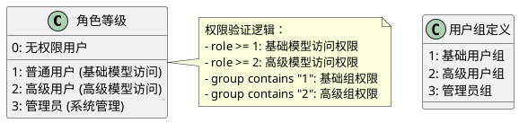
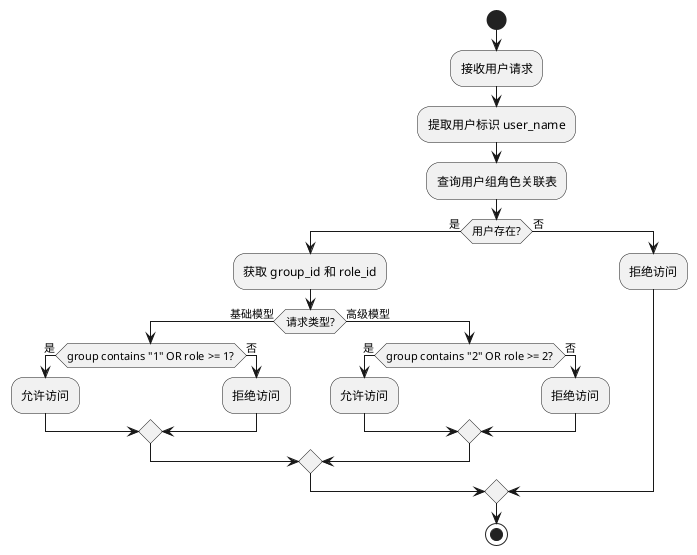

# LobeChatService 数据库设计文档

## 1. 数据库概述

LobeChatService 使用 MySQL 作为主数据库，Redis 作为缓存数据库。数据库设计遵循第三范式，采用合理的索引策略，支持高并发访问和数据一致性。

### 1.1 数据库配置
- **数据库类型**：MySQL
- **ORM框架**：SQLAlchemy 2.0.40
- **连接池大小**：500
- **最大溢出连接数**：10
- **字符集**：UTF-8

## 2. 数据库架构

```plantuml
@startuml
!define TABLE(name) class name << (T,#FFAAAA) >>

package "用户管理" {
  TABLE(t_lobechat_user_info) {
    + id : Integer PK
    + user_name : String(255)
    + chn_name : String(255)
    + departmentL1 : String(255)
    + departmentL2 : String(255)
    + departmentL3 : String(255)
    + departmentL4 : String(255)
    + departmentL5 : String(255)
    + departmentL6 : String(255)
  }
  
  TABLE(t_lobechat_user_group_role_link) {
    + user_name : String PK
    + link_group_id : String
    + link_role_id : String
  }
}

package "会话管理" {
  TABLE(t_lobechat_sessions) {
    + session_id : String PK
    + creation_time : DateTime
    + initial_persona : Text
    + session_name : String
    + topics : String
    + domain_account : String
  }
  
  TABLE(t_lobechat_messages_flask) {
    + message_id : Integer PK AI
    + model_name : String(100)
    + model_version : String(100)
    + tool_version : String(100)
    + user_input : Text
    + model_output : Text
    + sequence : Integer
    + access_time : DateTime
    + persona : Text
    + api_request_content : Text
    + api_response_content : Text
    + session_id : String FK
    + domain_account : String
  }
}

package "Token管理" {
  TABLE(t_lobechat_token_balances) {
    + domain_account : String(100) PK
    + token_count : Integer
    + created_at : DateTime
    + updated_at : DateTime
  }
  
  TABLE(t_lobechat_token_applications) {
    + application_id : Integer PK AI
    + domain_account : String
    + requested_tokens : Integer
    + status : String
    + application_time : DateTime
    + approval_time : DateTime
    + approved_by : String
    + reason : Text
  }
  
  TABLE(t_lobechat_token_usage_records) {
    + usage_id : Integer PK AI
    + domain_account : String
    + tokens_used : Integer
    + usage_time : DateTime
    + session_id : String
    + model_name : String
    + usage_type : String
  }
}

package "权限管理" {
  TABLE(t_lobechat_group_permission_records) {
    + record_id : Integer PK AI
    + group_id : String
    + permission_name : String
    + granted_at : DateTime
    + granted_by : String
  }
  
  TABLE(t_lobechat_repo_permission) {
    + permission_id : Integer PK AI
    + user_id : String
    + repo_name : String
    + permission_level : String
    + granted_at : DateTime
  }
}

package "内容管理" {
  TABLE(t_lobechat_notices) {
    + notice_id : Integer PK AI
    + title : String
    + content : Text
    + created_at : DateTime
    + updated_at : DateTime
    + is_active : Boolean
  }
  
  TABLE(t_lobechat_news_catalog) {
    + catalog_id : Integer PK AI
    + catalog_name : String
    + description : Text
    + created_at : DateTime
  }
  
  TABLE(t_lobechat_news_data) {
    + news_id : Integer PK AI
    + catalog_id : Integer FK
    + title : String
    + content : Text
    + author : String
    + published_at : DateTime
    + is_published : Boolean
  }
}

package "用户行为" {
  TABLE(t_lobechat_user_access) {
    + access_id : Integer PK AI
    + user_name : String
    + access_time : DateTime
    + ip_address : String
    + user_agent : String
  }
  
  TABLE(t_lobechat_user_favorites_data) {
    + favorite_id : Integer PK AI
    + user_name : String
    + content_type : String
    + content_id : String
    + created_at : DateTime
  }
  
  TABLE(t_lobechat_user_favorites_records) {
    + record_id : Integer PK AI
    + user_name : String
    + session_id : String
    + favorited_at : DateTime
  }
}

package "工具数据" {
  TABLE(t_lobechat_home_page_tool) {
    + tool_id : Integer PK AI
    + tool_name : String
    + tool_description : Text
    + tool_url : String
    + category : String
    + is_active : Boolean
    + created_at : DateTime
  }
}

' 关系定义
t_lobechat_messages_flask ||--|| t_lobechat_sessions : session_id
t_lobechat_token_applications ||--|| t_lobechat_user_info : domain_account
t_lobechat_token_balances ||--|| t_lobechat_user_info : domain_account
t_lobechat_token_usage_records ||--|| t_lobechat_user_info : domain_account
t_lobechat_user_group_role_link ||--|| t_lobechat_user_info : user_name
t_lobechat_news_data ||--|| t_lobechat_news_catalog : catalog_id

@enduml
```



## 3. 核心表详细设计

### 3.1 用户信息表 (t_lobechat_user_info)

```sql
CREATE TABLE t_lobechat_user_info (
    id INTEGER PRIMARY KEY AUTO_INCREMENT,
    user_name VARCHAR(255) NOT NULL COMMENT '用户名/工号',
    chn_name VARCHAR(255) COMMENT '中文姓名',
    departmentL1 VARCHAR(255) COMMENT '一级部门',
    departmentL2 VARCHAR(255) COMMENT '二级部门',
    departmentL3 VARCHAR(255) COMMENT '三级部门',
    departmentL4 VARCHAR(255) COMMENT '四级部门',
    departmentL5 VARCHAR(255) COMMENT '五级部门',
    departmentL6 VARCHAR(255) COMMENT '六级部门',
    INDEX idx_user_name (user_name)
) COMMENT='用户基本信息表';
```

**字段说明：**
- `id`：主键，自增整数
- `user_name`：用户标识，通常为工号
- `chn_name`：用户中文姓名
- `departmentL1-L6`：支持6级部门层级结构

### 3.2 会话表 (t_lobechat_sessions)

```sql
CREATE TABLE t_lobechat_sessions (
    session_id VARCHAR(100) PRIMARY KEY COMMENT '会话唯一标识',
    creation_time DATETIME NOT NULL COMMENT '创建时间',
    initial_persona TEXT COMMENT '初始人设',
    session_name VARCHAR(255) NOT NULL COMMENT '会话名称',
    topics VARCHAR(500) COMMENT '会话主题',
    domain_account VARCHAR(100) COMMENT '域账号',
    INDEX idx_domain_account (domain_account),
    INDEX idx_creation_time (creation_time)
) COMMENT='聊天会话表';
```

**字段说明：**
- `session_id`：会话唯一标识符
- `creation_time`：会话创建时间
- `initial_persona`：初始AI人设配置
- `session_name`：用户定义的会话名称
- `topics`：会话相关话题
- `domain_account`：关联的用户账号

### 3.3 消息表 (t_lobechat_messages_flask)

```sql
CREATE TABLE t_lobechat_messages_flask (
    message_id INTEGER PRIMARY KEY AUTO_INCREMENT COMMENT '消息唯一标识',
    model_name VARCHAR(100) COMMENT '使用的AI模型名称',
    model_version VARCHAR(100) COMMENT '模型版本',
    tool_version VARCHAR(100) COMMENT '工具版本',
    user_input TEXT COMMENT '用户输入内容',
    model_output TEXT COMMENT '模型输出内容',
    sequence INTEGER COMMENT '消息序号',
    access_time DATETIME COMMENT '访问时间',
    persona TEXT COMMENT '当前人设',
    api_request_content TEXT COMMENT 'API请求内容',
    api_response_content TEXT COMMENT 'API响应内容',
    session_id VARCHAR(100) COMMENT '关联会话ID',
    domain_account VARCHAR(100) COMMENT '用户域账号',
    INDEX idx_session_id (session_id),
    INDEX idx_domain_account (domain_account),
    INDEX idx_access_time (access_time),
    FOREIGN KEY (session_id) REFERENCES t_lobechat_sessions(session_id)
) COMMENT='聊天消息记录表';
```

**字段说明：**
- `message_id`：消息唯一标识
- `model_name/model_version`：使用的AI模型信息
- `user_input/model_output`：用户输入和AI输出内容
- `sequence`：消息在会话中的顺序
- `api_request/response_content`：完整的API交互记录

### 3.4 Token余额表 (t_lobechat_token_balances)

```sql
CREATE TABLE t_lobechat_token_balances (
    domain_account VARCHAR(100) PRIMARY KEY COMMENT '用户域账号',
    token_count INTEGER DEFAULT 0 COMMENT 'Token余额',
    created_at DATETIME DEFAULT CURRENT_TIMESTAMP COMMENT '创建时间',
    updated_at DATETIME DEFAULT CURRENT_TIMESTAMP ON UPDATE CURRENT_TIMESTAMP COMMENT '更新时间',
    INDEX idx_token_count (token_count)
) COMMENT='用户Token余额表';
```

### 3.5 Token申请表 (t_lobechat_token_applications)

```sql
CREATE TABLE t_lobechat_token_applications (
    application_id INTEGER PRIMARY KEY AUTO_INCREMENT COMMENT '申请ID',
    domain_account VARCHAR(100) NOT NULL COMMENT '申请用户',
    requested_tokens INTEGER NOT NULL COMMENT '申请Token数量',
    status VARCHAR(50) DEFAULT 'pending' COMMENT '申请状态',
    application_time DATETIME DEFAULT CURRENT_TIMESTAMP COMMENT '申请时间',
    approval_time DATETIME COMMENT '审批时间',
    approved_by VARCHAR(100) COMMENT '审批人',
    reason TEXT COMMENT '申请理由',
    INDEX idx_domain_account (domain_account),
    INDEX idx_status (status),
    INDEX idx_application_time (application_time)
) COMMENT='Token申请记录表';
```

### 3.6 Token使用记录表 (t_lobechat_token_usage_records)

```sql
CREATE TABLE t_lobechat_token_usage_records (
    usage_id INTEGER PRIMARY KEY AUTO_INCREMENT COMMENT '使用记录ID',
    domain_account VARCHAR(100) NOT NULL COMMENT '使用用户',
    tokens_used INTEGER NOT NULL COMMENT '使用Token数量',
    usage_time DATETIME DEFAULT CURRENT_TIMESTAMP COMMENT '使用时间',
    session_id VARCHAR(100) COMMENT '关联会话',
    model_name VARCHAR(100) COMMENT '使用模型',
    usage_type VARCHAR(50) COMMENT '使用类型',
    INDEX idx_domain_account (domain_account),
    INDEX idx_usage_time (usage_time),
    INDEX idx_session_id (session_id)
) COMMENT='Token使用记录表';
```

### 3.7 用户组角色关联表 (t_lobechat_user_group_role_link)

```sql
CREATE TABLE t_lobechat_user_group_role_link (
    user_name VARCHAR(100) PRIMARY KEY COMMENT '用户名',
    link_group_id VARCHAR(100) COMMENT '关联组ID',
    link_role_id VARCHAR(10) COMMENT '关联角色ID',
    INDEX idx_group_id (link_group_id),
    INDEX idx_role_id (link_role_id)
) COMMENT='用户组角色关联表';
```

## 4. 权限控制数据模型

### 4.1 权限等级定义



### 4.2 权限验证流程



## 5. 数据库索引策略

### 5.1 主要索引设计

```sql
-- 用户信息表索引
CREATE INDEX idx_user_name ON t_lobechat_user_info(user_name);
CREATE INDEX idx_department ON t_lobechat_user_info(departmentL1, departmentL2);

-- 消息表索引
CREATE INDEX idx_session_time ON t_lobechat_messages_flask(session_id, access_time);
CREATE INDEX idx_user_time ON t_lobechat_messages_flask(domain_account, access_time);
CREATE INDEX idx_model_time ON t_lobechat_messages_flask(model_name, access_time);

-- Token相关表索引
CREATE INDEX idx_balance_user ON t_lobechat_token_balances(domain_account);
CREATE INDEX idx_usage_user_time ON t_lobechat_token_usage_records(domain_account, usage_time);
CREATE INDEX idx_application_status_time ON t_lobechat_token_applications(status, application_time);

-- 会话表索引
CREATE INDEX idx_session_user_time ON t_lobechat_sessions(domain_account, creation_time);
```

### 5.2 复合索引策略

- **消息查询优化**：(session_id, access_time) 支持按会话时间查询
- **用户行为分析**：(domain_account, access_time) 支持用户活动分析
- **Token使用统计**：(domain_account, usage_time) 支持使用记录查询

## 6. 数据库连接和事务管理

### 6.1 连接池配置

```python
# 连接池配置参数
SQLALCHEMY_POOL_SIZE = 500          # 连接池大小
SQLALCHEMY_MAX_OVERFLOW = 10        # 最大溢出连接数
SQLALCHEMY_TRACK_MODIFICATIONS = False  # 禁用对象修改跟踪
```

### 6.2 事务管理策略

```plantuml
@startuml
start

:开始数据库操作;
:获取数据库连接;

try {
  :开始事务;
  :执行业务操作;
  :提交事务;
} catch (Exception) {
  :回滚事务;
  :记录错误日志;
  :抛出异常;
} finally {
  :释放数据库连接;
}

stop
@enduml
```

## 7. 数据备份和恢复策略

### 7.1 备份策略
- **全量备份**：每日凌晨执行
- **增量备份**：每小时执行
- **日志备份**：实时binlog备份

### 7.2 数据归档
- **消息数据**：按月归档历史消息
- **访问日志**：按周归档访问记录
- **使用记录**：按年归档Token使用历史

## 8. 数据库监控和优化

### 8.1 监控指标
- **连接池使用率**：监控连接池状态
- **查询性能**：慢查询监控和优化
- **表空间使用**：磁盘空间监控
- **索引效率**：索引使用情况分析

### 8.2 性能优化
- **查询优化**：基于explain分析优化查询
- **索引优化**：定期分析和重建索引
- **分区策略**：大表按时间分区
- **读写分离**：主从复制分离读写压力

## 9. 数据安全和合规

### 9.1 数据加密
- **传输加密**：SSL/TLS加密数据传输
- **存储加密**：敏感字段加密存储
- **配置加密**：数据库连接串Base64编码

### 9.2 数据脱敏
- **开发环境**：敏感数据脱敏处理
- **日志输出**：避免敏感信息泄露
- **API响应**：用户敏感信息过滤

## 10. 总结

LobeChatService的数据库设计采用了规范化的设计原则，通过合理的表结构设计、索引策略和事务管理，确保了数据的一致性、完整性和高性能访问。数据库设计支持系统的核心功能需求，同时具备良好的扩展性和维护性。