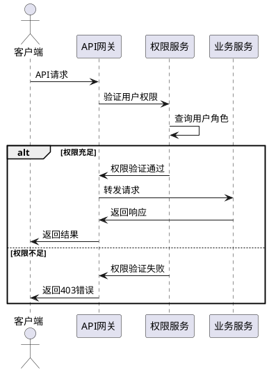

# LobeChatService API设计文档

## 1. API概述

LobeChatService 提供了一套完整的 RESTful API，支持用户管理、会话控制、消息处理、AI模型调用等核心功能。所有API遵循统一的设计规范，支持JSON格式数据交换。

### 1.1 API设计原则

- **RESTful风格**：遵循HTTP方法语义
- **统一响应格式**：标准化的响应结构
- **版本控制**：支持API版本管理
- **安全认证**：基于权限的访问控制
- **错误处理**：统一的错误码和消息

### 1.2 基础URL结构

```
{protocol}://{host}:{port}/api/{module}/{endpoint}
```

例如：`https://api.lobechat.com/api/sessions/create`

## 2. API模块架构

```plantuml
@startuml
!define MODULE rectangle

MODULE "用户管理 /api/users" as UserAPI {
  GET /api/users/{user_id}
  POST /api/users
  PUT /api/users/{user_id}
  DELETE /api/users/{user_id}
}

MODULE "会话管理 /api/sessions" as SessionAPI {
  POST /api/sessions
  GET /api/sessions/{session_id}
  PUT /api/sessions/{session_id}
  DELETE /api/sessions/{session_id}
}

MODULE "消息处理 /api/messages" as MessageAPI {
  POST /api/messages
  GET /api/messages/{session_id}
  PUT /api/messages/{message_id}
}

MODULE "AI生态系统" as AIAPI {
  POST /api/open_ai/run/v1/{user}/chat/completions
  POST /api/deepseek/run/v1/{user}/chat/completions
  POST /api/google/run/v1/{user}/chat/completions
  POST /api/anthropic/run/v1/{user}/chat/completions
  POST /api/kimi/run/v1/{user}/chat/completions
}

MODULE "Token管理" as TokenAPI {
  GET /api/token_balances/{user}
  POST /api/token_applications
  GET /api/token_usage_records/{user}
}

MODULE "权限管理" as PermissionAPI {
  GET /api/user_group_api/{user}
  POST /api/v1/repo_permissions
  GET /api/v1/repo_permissions/{user}
}

UserAPI --> SessionAPI : 用户创建会话
SessionAPI --> MessageAPI : 会话包含消息
MessageAPI --> AIAPI : 消息调用AI
TokenAPI --> AIAPI : Token控制访问
PermissionAPI --> AIAPI : 权限控制访问

@enduml
```

## 3. 通用响应格式

### 3.1 成功响应

```json
{
  "status": "success",
  "message": "操作成功",
  "data": {
    // 具体数据内容
  },
  "timestamp": "2024-01-01T12:00:00Z"
}
```

### 3.2 错误响应

```json
{
  "status": "error",
  "error_code": "AUTH_FAILED",
  "message": "用户认证失败",
  "details": "具体错误信息",
  "timestamp": "2024-01-01T12:00:00Z"
}
```

## 4. 核心API接口

### 4.1 会话管理API

#### 创建会话

```http
POST /api/sessions
Content-Type: application/json

{
  "session_id": "sess_123456789",
  "session_name": "技术讨论",
  "topics": "Python开发,AI应用",
  "initial_persona": "你是一个Python专家",
  "domain_account": "user001",
  "creation_time": "2024-01-01T12:00:00Z"
}
```

**响应示例：**
```json
{
  "status": "success",
  "message": "Session created successfully",
  "data": {
    "session_id": "sess_123456789",
    "session_name": "技术讨论"
  }
}
```

#### 更新会话

```http
PUT /api/sessions/{session_id}
Content-Type: application/json

{
  "session_name": "新的会话名称",
  "initial_persona": "更新的人设",
  "topics": "新的话题"
}
```

### 4.2 AI模型调用API

#### OpenAI聊天完成

```http
POST /api/open_ai/run/v1/{user_name}/chat/completions
Content-Type: application/json

{
  "model": "gpt-4",
  "messages": [
    {
      "role": "user",
      "content": "你好，请介绍一下Python"
    }
  ],
  "temperature": 0.7,
  "max_tokens": 1000,
  "stream": true
}
```

**流式响应示例：**
```
data: {"id":"chatcmpl-123","object":"chat.completion.chunk","created":1677652288,"model":"gpt-4","choices":[{"delta":{"content":"你好"},"index":0,"finish_reason":null}]}

data: {"id":"chatcmpl-123","object":"chat.completion.chunk","created":1677652288,"model":"gpt-4","choices":[{"delta":{"content":"！"},"index":0,"finish_reason":"stop"}]}
```

### 4.3 Token管理API

#### 查询Token余额

```http
GET /api/token_balances/{domain_account}
```

**响应示例：**
```json
{
  "status": "success",
  "data": {
    "domain_account": "user001",
    "token_count": 1000,
    "created_at": "2024-01-01T12:00:00Z",
    "updated_at": "2024-01-01T12:00:00Z"
  }
}
```

#### 申请Token

```http
POST /api/token_applications
Content-Type: application/json

{
  "domain_account": "user001",
  "requested_tokens": 500,
  "reason": "项目开发需要"
}
```

## 5. API权限控制

### 5.1 权限验证流程



### 5.2 权限级别定义

| 权限级别 | 角色要求 | 访问范围 |
|---------|---------|---------|
| 基础模型访问 | role >= 1 或 group contains "1" | 基础AI模型 |
| 高级模型访问 | role >= 2 或 group contains "2" | 高级AI模型 |
| 系统管理 | role >= 3 | 全部功能 |

## 6. 错误码定义

### 6.1 通用错误码

| 错误码 | HTTP状态码 | 描述 |
|--------|-----------|------|
| SUCCESS | 200 | 请求成功 |
| INVALID_REQUEST | 400 | 请求参数错误 |
| UNAUTHORIZED | 401 | 未授权访问 |
| FORBIDDEN | 403 | 权限不足 |
| NOT_FOUND | 404 | 资源不存在 |
| METHOD_NOT_ALLOWED | 405 | 请求方法不支持 |
| INTERNAL_ERROR | 500 | 服务器内部错误 |

### 6.2 业务错误码

| 错误码 | 描述 |
|--------|------|
| AUTH_FAILED | 用户认证失败 |
| PERMISSION_DENIED | 权限不足 |
| SESSION_NOT_FOUND | 会话不存在 |
| TOKEN_INSUFFICIENT | Token余额不足 |
| MODEL_UNAVAILABLE | AI模型服务不可用 |

## 7. API限流和安全

### 7.1 请求限流

- **基础用户**：100请求/分钟
- **高级用户**：500请求/分钟
- **管理员**：1000请求/分钟

### 7.2 安全措施

- **HTTPS加密**：所有API强制HTTPS
- **请求签名**：关键接口要求签名验证
- **IP白名单**：管理接口限制IP访问
- **内容过滤**：自动过滤敏感内容

## 8. API测试示例

### 8.1 cURL示例

```bash
# 创建会话
curl -X POST https://api.lobechat.com/api/sessions \
  -H "Content-Type: application/json" \
  -H "Authorization: Bearer your_token" \
  -d '{
    "session_id": "sess_001",
    "session_name": "测试会话",
    "topics": "API测试",
    "domain_account": "test_user"
  }'

# 调用AI模型
curl -X POST https://api.lobechat.com/api/open_ai/run/v1/test_user/chat/completions \
  -H "Content-Type: application/json" \
  -d '{
    "model": "gpt-3.5-turbo",
    "messages": [{"role": "user", "content": "Hello"}],
    "stream": true
  }'
```

### 8.2 Python SDK示例

```python
import requests

class LobeChatClient:
    def __init__(self, base_url, api_key):
        self.base_url = base_url
        self.headers = {
            'Content-Type': 'application/json',
            'Authorization': f'Bearer {api_key}'
        }
    
    def create_session(self, session_data):
        response = requests.post(
            f"{self.base_url}/api/sessions",
            json=session_data,
            headers=self.headers
        )
        return response.json()
    
    def chat_completion(self, user_name, messages, model="gpt-3.5-turbo"):
        response = requests.post(
            f"{self.base_url}/api/open_ai/run/v1/{user_name}/chat/completions",
            json={
                "model": model,
                "messages": messages,
                "stream": True
            },
            headers=self.headers,
            stream=True
        )
        return response
```

## 9. API版本管理

### 9.1 版本策略

- **主版本**：不兼容的API修改
- **次版本**：向后兼容的功能新增
- **修订版本**：向后兼容的问题修正

### 9.2 版本标识

- **URL路径**：`/api/v1/sessions`
- **请求头**：`API-Version: v1.0`
- **查询参数**：`?version=v1.0`

## 10. 总结

LobeChatService的API设计遵循RESTful原则，提供了完整的功能接口和统一的交互规范。通过合理的权限控制、错误处理和版本管理，确保了API的安全性、可用性和可维护性。