# LobeChatService 业务流程设计文档

## 1. 业务流程概述

LobeChatService 的核心业务流程包括用户认证、会话管理、消息处理、AI模型调用、Token管理等。本文档详细描述了各个业务流程的执行逻辑和交互关系。

## 2. 用户认证与权限验证流程

### 2.1 用户登录认证流程

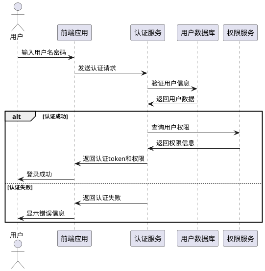

### 2.2 权限验证流程

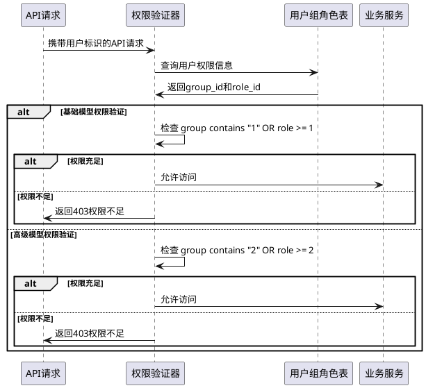

## 3. 会话管理流程

### 3.1 会话创建流程

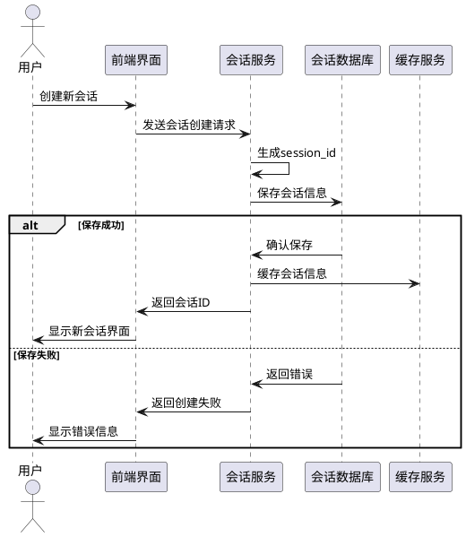

### 3.2 会话恢复流程

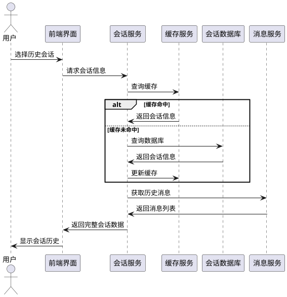

## 4. 消息处理与AI调用流程

### 4.1 消息发送与AI响应流程

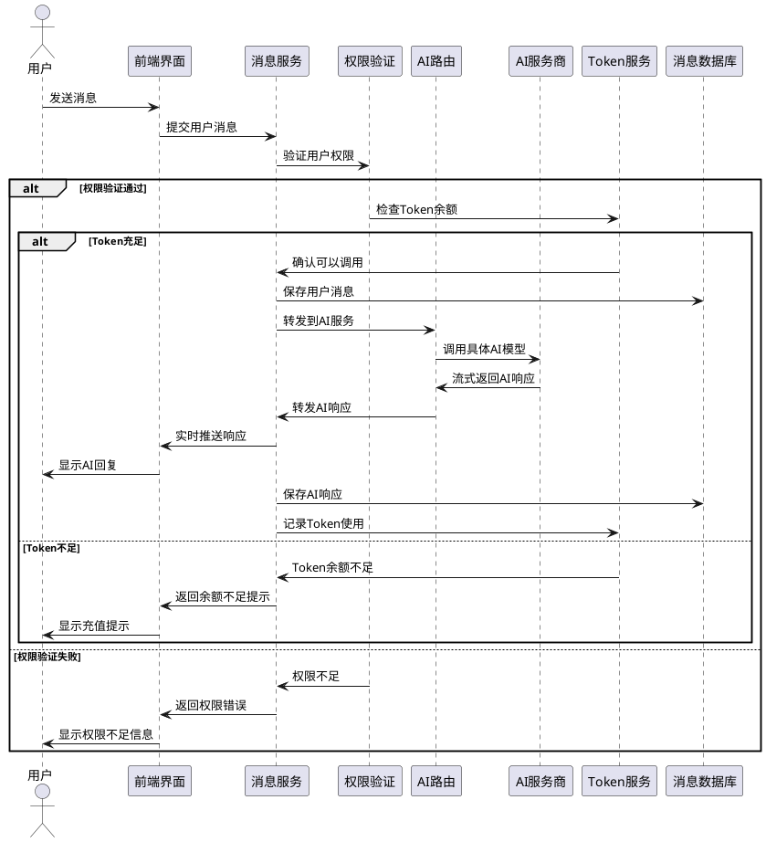

### 4.2 AI模型选择与负载均衡流程

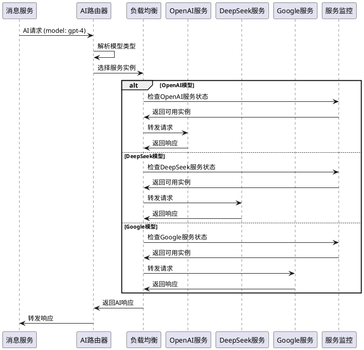

## 5. Token管理流程

### 5.1 Token申请流程

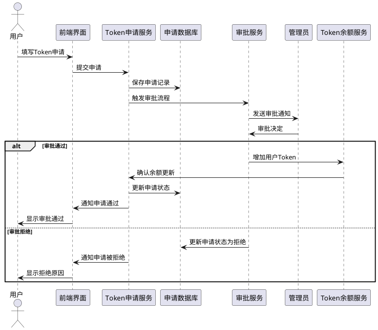

### 5.2 Token使用与扣减流程

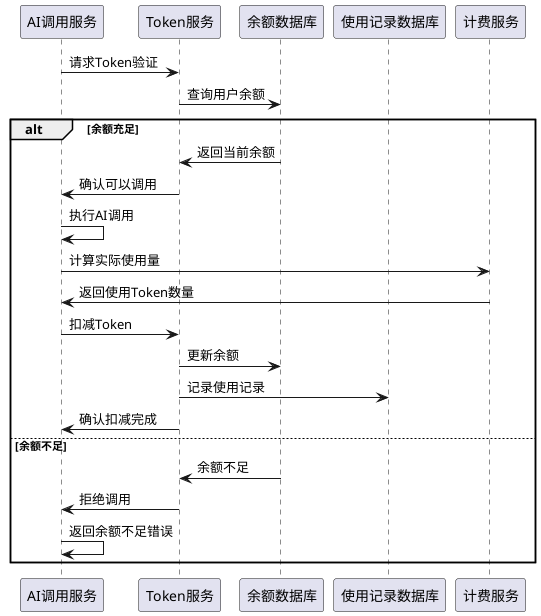

## 6. 通知系统流程

### 6.1 系统通知发布流程

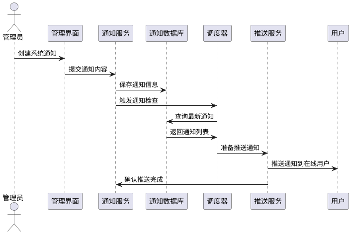

### 6.2 定时任务调度流程

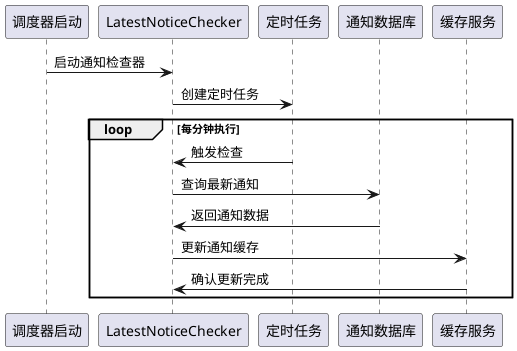

## 7. 文件上传处理流程

### 7.1 文件上传流程

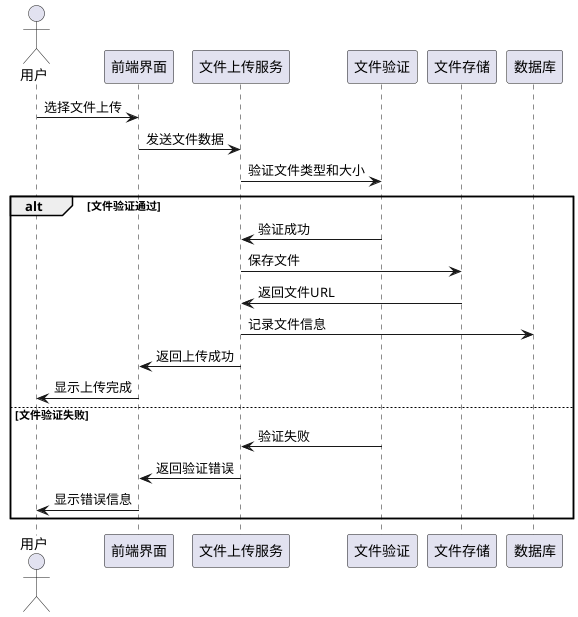

## 8. 安全模块流程

### 8.1 消息内容过滤流程

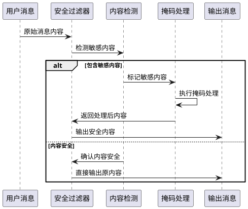

## 9. 系统监控与日志流程

### 9.1 访问日志记录流程

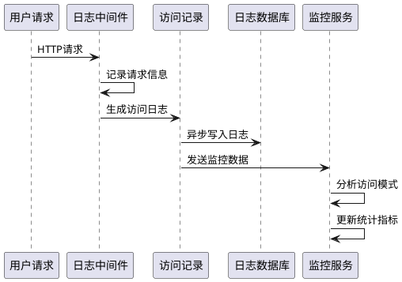

## 10. 异常处理流程

### 10.1 系统异常处理流程

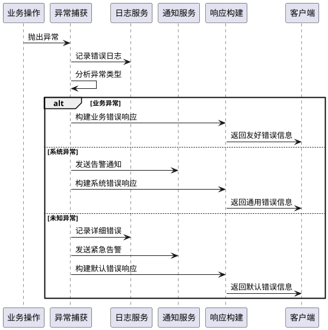

## 11. 总结

LobeChatService的业务流程设计覆盖了用户认证、会话管理、消息处理、AI调用、Token管理等核心业务场景。通过详细的时序图和流程描述，确保了各个模块之间的协调配合和异常情况的妥善处理。