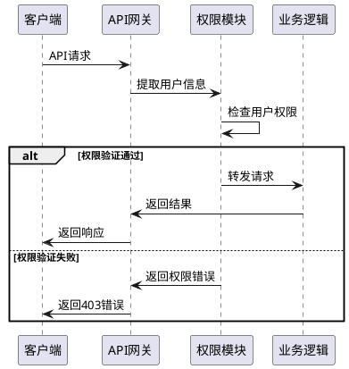

# LobeChatService API设计文档

## 1. API概览

LobeChatService提供RESTful API服务，支持多种AI模型集成和完整的聊天功能。所有API遵循统一的设计规范，使用JSON格式进行数据交换。

### 1.1 基础信息

- **协议**：HTTP/HTTPS
- **数据格式**：JSON
- **编码**：UTF-8
- **认证方式**：基于用户名的权限验证
- **CORS**：支持跨域请求

### 1.2 API版本

当前API版本：v1

## 2. API分组

### 2.1 核心功能API

| 分组 | 路径前缀 | 功能描述 |
|------|----------|----------|
| 用户管理 | `/api/users` | 用户信息管理 |
| 会话管理 | `/api/sessions` | 会话创建和管理 |
| 消息处理 | `/api/messages` | 消息发送和获取 |
| AI模型 | `/api/{model_name}` | 各AI模型调用接口 |

### 2.2 管理功能API

| 分组 | 路径前缀 | 功能描述 |
|------|----------|----------|
| Token管理 | `/api/token_*` | Token余额、申请、使用记录 |
| 权限管理 | `/api/v1/repo_permissions` | 仓库权限管理 |
| 用户组 | `/api/user_group_api` | 用户组管理 |
| 通知系统 | `/api/notice_api` | 系统通知管理 |
| 数据追踪 | `/api/user_access` | 用户访问数据 |

### 2.3 辅助功能API

| 分组 | 路径前缀 | 功能描述 |
|------|----------|----------|
| 文件服务 | `/api/upload_to_server` | 图片上传服务 |
| 安全模块 | `/api/security` | 敏感信息脱敏 |
| 主页API | `/api/home_page_api` | 主页数据接口 |

## 3. 会话管理API

### 3.1 创建会话

```http
POST /api/sessions
```

**请求体：**
```json
{
  "session_id": "unique_session_id",
  "session_name": "会话名称", 
  "topics": "会话主题描述",
  "initial_persona": "初始人设(可选)",
  "creation_time": "2024-01-01T10:00:00Z",
  "domain_account": "user@domain.com"
}
```

**响应体：**
```json
{
  "status": "success",
  "message": "Session created successfully",
  "data": {
    "session_id": "unique_session_id",
    "session_name": "会话名称"
  }
}
```

### 3.2 更新会话

```http
PUT /api/sessions/{session_id}
```

**请求体：**
```json
{
  "session_name": "新的会话名称",
  "topics": "更新的主题",
  "initial_persona": "更新的人设"
}
```

## 4. AI模型调用API

### 4.1 通用模型调用接口

所有AI模型使用统一的调用接口格式：

```http
POST /api/{model_name}/run/v1/{user_name}/chat/completions
```

支持的模型：
- `open_ai` - OpenAI GPT系列
- `deepseek` - DeepSeek模型
- `google` - Google Gemini
- `anthropic` - Claude系列
- `kimi` - Moonshot Kimi

### 4.2 OpenAI调用示例

```http
POST /api/open_ai/run/v1/john_doe/chat/completions
```

**请求体：**
```json
{
  "model": "gpt-4",
  "messages": [
    {
      "role": "user",
      "content": "你好，请介绍一下你自己"
    }
  ],
  "stream": true,
  "temperature": 0.7,
  "max_tokens": 1000
}
```

**响应：**
- 成功(200)：返回流式响应或JSON响应
- 权限不足：返回权限错误信息
- 模型错误：返回具体错误信息

## 5. Token管理API

### 5.1 查询Token余额

```http
GET /api/token_balances?user_name={user_name}&model_name={model_name}
```

### 5.2 申请Token

```http
POST /api/token_applications
```

**请求体：**
```json
{
  "user_name": "john_doe",
  "requested_amount": 10000,
  "model_name": "gpt-4",
  "application_reason": "项目开发需要",
  "department": "技术部",
  "business_scenario": "AI助手开发"
}
```

### 5.3 查询使用记录

```http
GET /api/token_usage_records?user_name={user_name}&start_date={date}&end_date={date}
```

## 6. 权限验证流程



## 7. 响应格式规范

### 7.1 成功响应

```json
{
  "status": "success",
  "message": "操作成功描述",
  "data": {
    // 具体数据内容
  },
  "timestamp": "2024-01-01T10:00:00Z"
}
```

### 7.2 错误响应

```json
{
  "status": "error", 
  "error_code": "ERROR_CODE",
  "message": "错误描述信息",
  "details": {
    // 错误详细信息
  },
  "timestamp": "2024-01-01T10:00:00Z"
}
```

### 7.3 状态码说明

| 状态码 | 说明 | 使用场景 |
|--------|------|----------|
| 200 | 成功 | 请求处理成功 |
| 201 | 创建成功 | 资源创建成功 |
| 400 | 请求错误 | 参数格式错误 |
| 401 | 未授权 | 认证失败 |
| 403 | 禁止访问 | 权限不足 |
| 404 | 资源不存在 | 请求的资源不存在 |
| 500 | 服务器错误 | 内部服务器错误 |

## 8. 流式响应处理

对于AI模型调用，支持Server-Sent Events (SSE)流式响应：

```javascript
// 前端处理流式响应示例
const eventSource = new EventSource('/api/open_ai/run/v1/user/chat/completions');

eventSource.onmessage = function(event) {
  const data = JSON.parse(event.data);
  // 处理流式数据
  console.log(data);
};

eventSource.onerror = function(event) {
  console.error('Stream error:', event);
  eventSource.close();
};
```

## 9. API安全规范

### 9.1 敏感信息脱敏

```http
POST /api/security/mask_sensitive
```

**请求体：**
```json
{
  "message": "包含敏感信息的文本内容",
  "repo_name": "代码仓库名称"
}
```

**响应体：**
```json
{
  "masked_message": "脱敏后的文本内容"
}
```

### 9.2 请求限制

- **频率限制**：每用户每分钟最多100次请求
- **大小限制**：单次请求最大10MB
- **并发限制**：每用户最大10个并发请求

### 9.3 数据验证

所有API请求都会进行以下验证：
- 参数格式验证
- 必填字段检查
- 数据类型校验
- 业务规则验证

## 10. API监控与日志

### 10.1 监控指标

- **响应时间**：API调用响应时间分布
- **成功率**：请求成功率统计
- **错误率**：各类错误的发生频率
- **并发量**：实时并发请求数量

### 10.2 日志格式

```json
{
  "timestamp": "2024-01-01T10:00:00Z",
  "level": "INFO",
  "user": "john_doe",
  "endpoint": "/api/open_ai/run/v1/john_doe/chat/completions",
  "method": "POST",
  "status_code": 200,
  "response_time": 1250,
  "request_id": "req_123456789"
}
```