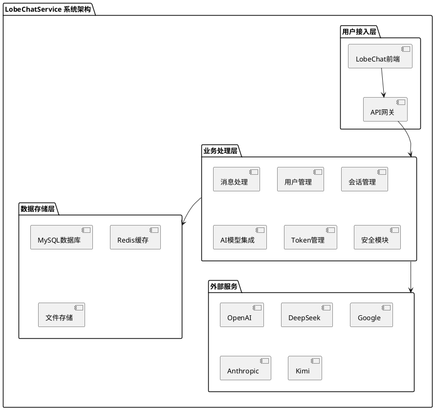

# LobeChatService 设计文档索引

## 📚 文档概览

本目录包含了LobeChatService项目的完整设计文档，涵盖了系统架构、数据库设计、API规范、模块设计等各个方面。所有文档基于现有代码实现编写，确保与实际系统保持一致。

## 📋 文档清单

### 🏗️ 核心设计文档

| 文档名称 | 描述 | 适用人群 |
|---------|------|----------|
| [项目架构设计文档](./项目架构设计文档.md) | 系统整体架构、技术选型、模块组织 | 架构师、技术负责人 |
| [数据库设计文档](./数据库设计文档.md) | 数据模型、表结构、关系设计 | 数据库管理员、后端开发 |
| [API设计文档](./API设计文档.md) | RESTful API规范、接口定义 | 前端开发、接口集成 |
| [模块设计文档](./模块设计文档.md) | 各功能模块详细设计、类图 | 后端开发、系统分析师 |

### 🛠️ 运维文档

| 文档名称 | 描述 | 适用人群 |
|---------|------|----------|
| [部署运维文档](./部署运维文档.md) | 部署指南、监控告警、故障排查 | 运维工程师、DevOps |
| [安全验证模块设计文档](./安全验证模块设计文档.md) | 敏感信息脱敏模块设计 | 安全工程师、后端开发 |

## 🎯 快速导航

### 🔍 按角色查看文档

**架构师/技术负责人**
1. [项目架构设计文档](./项目架构设计文档.md) - 了解整体架构
2. [模块设计文档](./模块设计文档.md) - 深入模块设计
3. [数据库设计文档](./数据库设计文档.md) - 数据架构设计

**后端开发工程师**
1. [模块设计文档](./模块设计文档.md) - 模块开发指南
2. [API设计文档](./API设计文档.md) - API接口规范
3. [数据库设计文档](./数据库设计文档.md) - 数据模型参考

**前端开发工程师**
1. [API设计文档](./API设计文档.md) - 接口调用指南
2. [项目架构设计文档](./项目架构设计文档.md) - 系统概览

**运维/DevOps工程师**
1. [部署运维文档](./部署运维文档.md) - 部署运维指南
2. [项目架构设计文档](./项目架构设计文档.md) - 架构理解

**安全工程师**
1. [安全验证模块设计文档](./安全验证模块设计文档.md) - 安全模块设计
2. [部署运维文档](./部署运维文档.md) - 安全运维

### 📊 按功能模块查看

**用户管理相关**
- [模块设计文档 - 用户管理模块](./模块设计文档.md#21-用户管理模块)
- [数据库设计文档 - 用户信息表](./数据库设计文档.md#31-用户信息表)
- [API设计文档 - 权限验证](./API设计文档.md#6-权限验证流程)

**会话管理相关**
- [模块设计文档 - 会话管理模块](./模块设计文档.md#22-会话管理模块)
- [数据库设计文档 - 会话表](./数据库设计文档.md#32-会话表)
- [API设计文档 - 会话管理API](./API设计文档.md#3-会话管理api)

**AI模型集成相关**
- [模块设计文档 - AI模型集成模块](./模块设计文档.md#24-ai模型集成模块)
- [API设计文档 - AI模型调用API](./API设计文档.md#4-ai模型调用api)
- [项目架构设计文档 - 多模型适配](./项目架构设计文档.md#61-ai模型扩展)

**Token管理相关**
- [模块设计文档 - Token管理模块](./模块设计文档.md#25-token管理模块)
- [数据库设计文档 - Token相关表](./数据库设计文档.md#34-token余额表)
- [API设计文档 - Token管理API](./API设计文档.md#5-token管理api)

## 🚀 快速开始

### 新团队成员入门建议

1. **第一步**：阅读[项目架构设计文档](./项目架构设计文档.md)，了解系统整体设计
2. **第二步**：根据角色查看对应的详细文档
3. **第三步**：结合实际代码理解设计意图

### 文档更新维护

- **更新频率**：跟随代码变更及时更新
- **维护原则**：文档与代码实现保持一致
- **版本控制**：文档变更与代码版本同步

## 📈 系统概览图

## 📞 技术支持

如果您在使用这些设计文档时有任何问题：

1. **代码实现问题**：请参考项目源代码
2. **架构设计问题**：请查阅[项目架构设计文档](./项目架构设计文档.md)
3. **API接口问题**：请查阅[API设计文档](./API设计文档.md)
4. **部署运维问题**：请查阅[部署运维文档](./部署运维文档.md)

## 📝 文档贡献

欢迎为项目文档做出贡献：

1. 发现文档错误或过时信息，请及时反馈
2. 补充遗漏的设计说明
3. 优化文档结构和表达

---

*本文档集合最后更新时间：2024年*