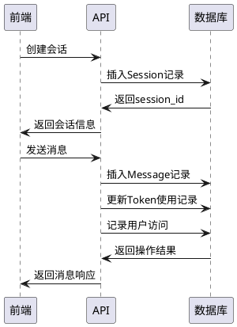

# LobeChatService 数据库设计文档

## 1. 数据库概览

LobeChatService使用关系型数据库(MySQL)作为主要数据存储，采用SQLAlchemy ORM框架进行数据访问。数据库设计遵循第三范式，确保数据一致性和完整性。

### 1.1 数据库配置

```python
# 连接池配置
SQLALCHEMY_POOL_SIZE = 500           # 连接池大小
SQLALCHEMY_MAX_OVERFLOW = 10         # 最大溢出连接数  
SQLALCHEMY_TRACK_MODIFICATIONS = False
```

## 2. 数据模型设计

### 2.1 实体关系图

```plantuml
@startuml ER图
!define PRIMARY_KEY(x) <b><color:#b8861b><&key></color> x</b>
!define FOREIGN_KEY(x) <color:#aaaaaa><&key></color> x
!define COLUMN(x) <color:#efefef><&media-record></color> x
!define TABLE(x) entity x << (T, white) >>

TABLE(User_Info) {
  PRIMARY_KEY(id) : INTEGER
  COLUMN(user_name) : VARCHAR(255)
  COLUMN(chn_name) : VARCHAR(255)
  COLUMN(departmentL1) : VARCHAR(255)
  COLUMN(departmentL2) : VARCHAR(255)
  COLUMN(departmentL3) : VARCHAR(255)
  COLUMN(departmentL4) : VARCHAR(255)
  COLUMN(departmentL5) : VARCHAR(255)
  COLUMN(departmentL6) : VARCHAR(255)
}

TABLE(Session) {
  PRIMARY_KEY(session_id) : VARCHAR(100)
  COLUMN(creation_time) : DATETIME
  COLUMN(initial_persona) : TEXT
  COLUMN(session_name) : VARCHAR(100)
  COLUMN(topics) : TEXT
  COLUMN(domain_account) : VARCHAR(100)
}

TABLE(Message) {
  PRIMARY_KEY(message_id) : INTEGER
  COLUMN(model_name) : VARCHAR(100)
  COLUMN(model_version) : VARCHAR(100)
  COLUMN(tool_version) : VARCHAR(100)
  COLUMN(user_input) : TEXT
  COLUMN(model_output) : TEXT
  COLUMN(sequence) : INTEGER
  COLUMN(access_time) : DATETIME
  COLUMN(persona) : TEXT
  COLUMN(api_request_content) : TEXT
  COLUMN(api_response_content) : TEXT
  FOREIGN_KEY(session_id) : VARCHAR(100)
  COLUMN(domain_account) : VARCHAR(100)
}

TABLE(Token_Balance) {
  PRIMARY_KEY(id) : INTEGER
  COLUMN(user_name) : VARCHAR(255)
  COLUMN(balance) : DECIMAL
  COLUMN(model_name) : VARCHAR(100)
  COLUMN(update_time) : DATETIME
}

TABLE(Token_Application) {
  PRIMARY_KEY(id) : INTEGER
  COLUMN(user_name) : VARCHAR(255)
  COLUMN(requested_amount) : DECIMAL
  COLUMN(model_name) : VARCHAR(100)
  COLUMN(application_reason) : TEXT
  COLUMN(status) : VARCHAR(50)
  COLUMN(application_time) : DATETIME
  COLUMN(review_time) : DATETIME
  COLUMN(reviewer) : VARCHAR(255)
  COLUMN(review_comments) : TEXT
  COLUMN(approved_amount) : DECIMAL
  COLUMN(department) : VARCHAR(255)
  COLUMN(business_scenario) : TEXT
}

TABLE(Token_Usage_Record) {
  PRIMARY_KEY(id) : INTEGER
  COLUMN(user_name) : VARCHAR(255)
  COLUMN(model_name) : VARCHAR(100)
  COLUMN(prompt_tokens) : INTEGER
  COLUMN(completion_tokens) : INTEGER
  COLUMN(total_tokens) : INTEGER
  COLUMN(usage_time) : DATETIME
  COLUMN(session_id) : VARCHAR(100)
  COLUMN(department) : VARCHAR(255)
}

TABLE(User_Group_Role_Link) {
  PRIMARY_KEY(id) : INTEGER
  COLUMN(user_name) : VARCHAR(255)
  COLUMN(group_name) : VARCHAR(255)
  COLUMN(role_name) : VARCHAR(255)
  COLUMN(create_time) : DATETIME
}

TABLE(Group_Permission_Records) {
  PRIMARY_KEY(id) : INTEGER
  COLUMN(group_name) : VARCHAR(255)
  COLUMN(permission_name) : VARCHAR(255)
  COLUMN(permission_description) : TEXT
  COLUMN(create_time) : DATETIME
  COLUMN(update_time) : DATETIME
  COLUMN(creator) : VARCHAR(255)
  COLUMN(status) : VARCHAR(50)
}

TABLE(Repo_Permission) {
  PRIMARY_KEY(id) : INTEGER
  COLUMN(user_name) : VARCHAR(255)
  COLUMN(repo_name) : VARCHAR(255)
  COLUMN(permission_type) : VARCHAR(100)
  COLUMN(granted_time) : DATETIME
  COLUMN(granted_by) : VARCHAR(255)
}

TABLE(User_Access) {
  PRIMARY_KEY(id) : INTEGER
  COLUMN(user_name) : VARCHAR(255)
  COLUMN(access_time) : DATETIME
  COLUMN(ip_address) : VARCHAR(45)
  COLUMN(user_agent) : TEXT
  COLUMN(endpoint) : VARCHAR(255)
}

TABLE(Notices) {
  PRIMARY_KEY(id) : INTEGER
  COLUMN(title) : VARCHAR(500)
  COLUMN(content) : TEXT
  COLUMN(type) : VARCHAR(100)
  COLUMN(priority) : VARCHAR(50)
  COLUMN(status) : VARCHAR(50)
  COLUMN(create_time) : DATETIME
  COLUMN(update_time) : DATETIME
  COLUMN(creator) : VARCHAR(255)
  COLUMN(valid_until) : DATETIME
}

Session ||--o{ Message : contains
User_Info ||--o{ Token_Balance : has
User_Info ||--o{ Token_Application : applies
User_Info ||--o{ Token_Usage_Record : uses
User_Info ||--o{ User_Group_Role_Link : belongs_to
User_Info ||--o{ Repo_Permission : has_access
User_Info ||--o{ User_Access : accesses
@enduml
```



## 3. 核心表结构详解

### 3.1 用户信息表 (t_lobechat_user_info)

| 字段名 | 类型 | 约束 | 说明 |
|--------|------|------|------|
| id | INTEGER | PRIMARY KEY | 用户ID(自增) |
| user_name | VARCHAR(255) | | 用户名 |
| chn_name | VARCHAR(255) | | 中文姓名 |
| departmentL1 | VARCHAR(255) | | 一级部门 |
| departmentL2 | VARCHAR(255) | | 二级部门 |
| departmentL3 | VARCHAR(255) | | 三级部门 |
| departmentL4 | VARCHAR(255) | | 四级部门 |
| departmentL5 | VARCHAR(255) | | 五级部门 |
| departmentL6 | VARCHAR(255) | | 六级部门 |

**设计说明**：支持多层级部门结构，便于组织架构管理和权限分配。

### 3.2 会话表 (t_lobechat_sessions_flask)

| 字段名 | 类型 | 约束 | 说明 |
|--------|------|------|------|
| session_id | VARCHAR(100) | PRIMARY KEY | 会话唯一标识 |
| creation_time | DATETIME | | 创建时间 |
| initial_persona | TEXT | | 初始人设 |
| session_name | VARCHAR(100) | | 会话名称 |
| topics | TEXT | | 会话主题(JSON格式) |
| domain_account | VARCHAR(100) | | 域账户 |

**设计说明**：session_id作为主键，支持自定义会话标识，便于前端管理。

### 3.3 消息表 (t_lobechat_messages_flask)

| 字段名 | 类型 | 约束 | 说明 |
|--------|------|------|------|
| message_id | INTEGER | PRIMARY KEY AUTO_INCREMENT | 消息ID |
| model_name | VARCHAR(100) | | 模型名称 |
| model_version | VARCHAR(100) | | 模型版本 |
| tool_version | VARCHAR(100) | | 工具版本 |
| user_input | TEXT | | 用户输入 |
| model_output | TEXT | | 模型输出 |
| sequence | INTEGER | | 消息序号 |
| access_time | DATETIME | | 访问时间 |
| persona | TEXT | | 人设信息 |
| api_request_content | TEXT | NULLABLE | API请求内容 |
| api_response_content | TEXT | NULLABLE | API响应内容 |
| session_id | VARCHAR(100) | FOREIGN KEY | 会话ID |
| domain_account | VARCHAR(100) | | 域账户 |

**设计说明**：记录完整的对话信息，包括API调用详情，支持对话历史回溯。

### 3.4 Token余额表

| 字段名 | 类型 | 约束 | 说明 |
|--------|------|------|------|
| id | INTEGER | PRIMARY KEY | 记录ID |
| user_name | VARCHAR(255) | | 用户名 |
| balance | DECIMAL | | 余额 |
| model_name | VARCHAR(100) | | 模型名称 |
| update_time | DATETIME | | 更新时间 |

### 3.5 Token申请表

| 字段名 | 类型 | 约束 | 说明 |
|--------|------|------|------|
| id | INTEGER | PRIMARY KEY | 申请ID |
| user_name | VARCHAR(255) | | 申请用户 |
| requested_amount | DECIMAL | | 申请数量 |
| model_name | VARCHAR(100) | | 模型名称 |
| application_reason | TEXT | | 申请理由 |
| status | VARCHAR(50) | | 申请状态 |
| application_time | DATETIME | | 申请时间 |
| review_time | DATETIME | | 审核时间 |
| reviewer | VARCHAR(255) | | 审核人 |
| review_comments | TEXT | | 审核意见 |
| approved_amount | DECIMAL | | 批准数量 |
| department | VARCHAR(255) | | 部门 |
| business_scenario | TEXT | | 业务场景 |

### 3.6 Token使用记录表

| 字段名 | 类型 | 约束 | 说明 |
|--------|------|------|------|
| id | INTEGER | PRIMARY KEY | 记录ID |
| user_name | VARCHAR(255) | | 用户名 |
| model_name | VARCHAR(100) | | 模型名称 |
| prompt_tokens | INTEGER | | 提示词Token数 |
| completion_tokens | INTEGER | | 回复Token数 |
| total_tokens | INTEGER | | 总Token数 |
| usage_time | DATETIME | | 使用时间 |
| session_id | VARCHAR(100) | | 会话ID |
| department | VARCHAR(255) | | 部门 |

## 4. 权限管理相关表

### 4.1 用户组角色关联表

```sql
CREATE TABLE user_group_role_link (
    id INTEGER PRIMARY KEY AUTO_INCREMENT,
    user_name VARCHAR(255),
    group_name VARCHAR(255),
    role_name VARCHAR(255),
    create_time DATETIME,
    INDEX idx_user_name (user_name),
    INDEX idx_group_name (group_name)
);
```

### 4.2 组权限记录表

```sql
CREATE TABLE group_permission_records (
    id INTEGER PRIMARY KEY AUTO_INCREMENT,
    group_name VARCHAR(255),
    permission_name VARCHAR(255),
    permission_description TEXT,
    create_time DATETIME,
    update_time DATETIME,
    creator VARCHAR(255),
    status VARCHAR(50),
    INDEX idx_group_name (group_name)
);
```

### 4.3 仓库权限表

```sql
CREATE TABLE repo_permission (
    id INTEGER PRIMARY KEY AUTO_INCREMENT,
    user_name VARCHAR(255),
    repo_name VARCHAR(255),
    permission_type VARCHAR(100),
    granted_time DATETIME,
    granted_by VARCHAR(255),
    INDEX idx_user_repo (user_name, repo_name)
);
```

## 5. 业务逻辑表

### 5.1 用户访问记录表

```sql
CREATE TABLE user_access (
    id INTEGER PRIMARY KEY AUTO_INCREMENT,
    user_name VARCHAR(255),
    access_time DATETIME,
    ip_address VARCHAR(45),
    user_agent TEXT,
    endpoint VARCHAR(255),
    INDEX idx_user_time (user_name, access_time)
);
```

### 5.2 通知公告表

```sql
CREATE TABLE notices (
    id INTEGER PRIMARY KEY AUTO_INCREMENT,
    title VARCHAR(500),
    content TEXT,
    type VARCHAR(100),
    priority VARCHAR(50),
    status VARCHAR(50),
    create_time DATETIME,
    update_time DATETIME,
    creator VARCHAR(255),
    valid_until DATETIME,
    INDEX idx_status_time (status, create_time)
);
```

## 6. 数据流转设计

### 6.1 会话消息流转



## 7. 索引设计

### 7.1 主要索引

```sql
-- 会话相关索引
CREATE INDEX idx_session_domain_account ON t_lobechat_sessions_flask(domain_account);
CREATE INDEX idx_session_creation_time ON t_lobechat_sessions_flask(creation_time);

-- 消息相关索引
CREATE INDEX idx_message_session_id ON t_lobechat_messages_flask(session_id);
CREATE INDEX idx_message_domain_account ON t_lobechat_messages_flask(domain_account);
CREATE INDEX idx_message_access_time ON t_lobechat_messages_flask(access_time);
CREATE INDEX idx_message_model_name ON t_lobechat_messages_flask(model_name);

-- Token相关索引
CREATE INDEX idx_token_balance_user_model ON token_balance(user_name, model_name);
CREATE INDEX idx_token_usage_user_time ON token_usage_record(user_name, usage_time);
CREATE INDEX idx_token_application_user_status ON token_application(user_name, status);

-- 权限相关索引
CREATE INDEX idx_user_group_user_name ON user_group_role_link(user_name);
CREATE INDEX idx_repo_permission_user_repo ON repo_permission(user_name, repo_name);
```

## 8. 数据备份与恢复

### 8.1 备份策略

- **全量备份**：每日凌晨进行全量数据备份
- **增量备份**：每小时进行增量备份
- **日志备份**：实时备份binlog

### 8.2 数据保留策略

- **会话数据**：保留180天
- **消息数据**：保留90天
- **Token记录**：保留365天
- **访问日志**：保留30天
- **系统日志**：保留7天

## 9. 性能优化

### 9.1 分区策略

```sql
-- 按月分区消息表
ALTER TABLE t_lobechat_messages_flask 
PARTITION BY RANGE (YEAR(access_time)*100 + MONTH(access_time)) (
    PARTITION p202401 VALUES LESS THAN (202402),
    PARTITION p202402 VALUES LESS THAN (202403),
    ...
);
```

### 9.2 查询优化

- **读写分离**：读操作使用从库，写操作使用主库
- **缓存策略**：热点数据缓存到Redis
- **批量操作**：批量插入和更新操作
- **连接池**：数据库连接池优化

## 10. 数据一致性

### 10.1 事务设计

```python
@db.session.begin()
def create_session_with_message():
    # 创建会话
    session = Session(...)
    db.session.add(session)
    
    # 创建消息
    message = Message(...)
    db.session.add(message)
    
    # 更新Token使用
    usage_record = Token_Usage_Record(...)
    db.session.add(usage_record)
    
    db.session.commit()
```

### 10.2 数据校验

- **外键约束**：确保数据引用完整性
- **检查约束**：业务规则校验
- **触发器**：自动更新相关字段
- **应用层校验**：业务逻辑验证