# LobeChatService 模块设计文档

## 1. 模块概览

LobeChatService采用模块化设计，将不同功能划分为独立的模块，便于开发、测试和维护。每个模块都有明确的职责边界和接口定义。

### 1.1 模块分层

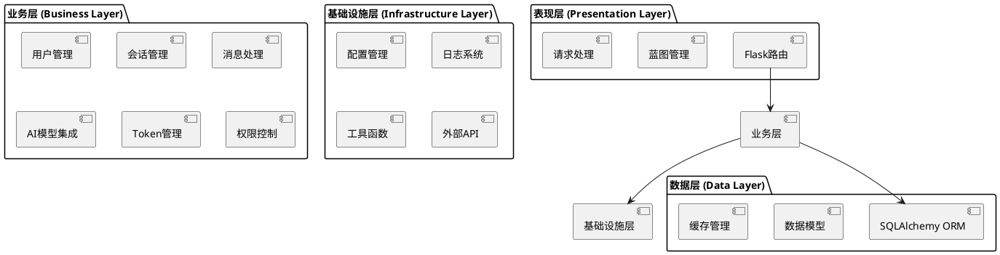

## 2. 核心模块设计

### 2.1 用户管理模块

**模块路径**：`routes/user_permission/`

**核心功能**：
- 用户信息管理
- 用户组管理
- 权限验证
- 访问控制

**类图设计**：
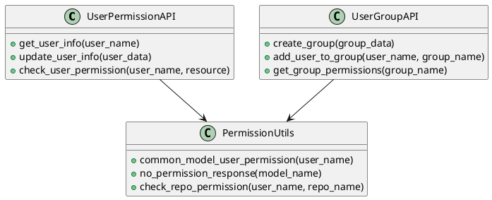

### 2.2 会话管理模块

**模块路径**：`routes/sessions.py`

**核心功能**：
- 会话创建和初始化
- 会话状态管理
- 会话信息更新
- 会话历史查询

**时序图**：
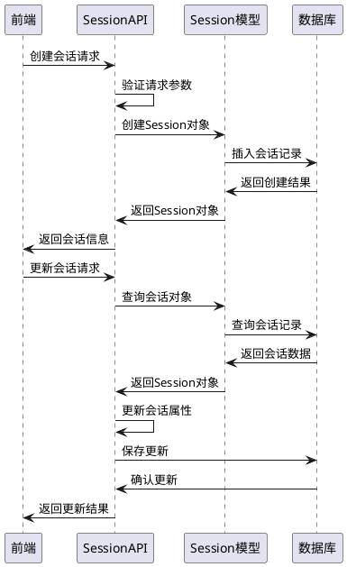

### 2.3 消息处理模块

**模块路径**：`routes/messages.py`

**核心功能**：
- 消息存储和检索
- 消息序列管理
- API调用记录
- 对话历史维护

**数据流图**：
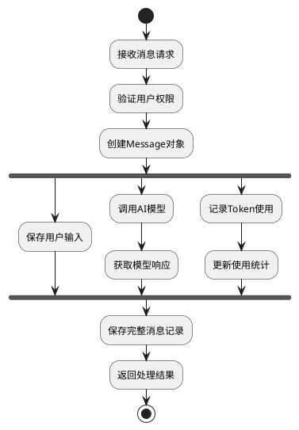

### 2.4 AI模型集成模块

**模块路径**：`routes/open_ai_ecosystem_api/`

**设计模式**：策略模式

**核心功能**：
- 统一的AI模型调用接口
- 多模型适配器
- 流式响应处理
- 错误处理和重试

**模型适配器设计**：
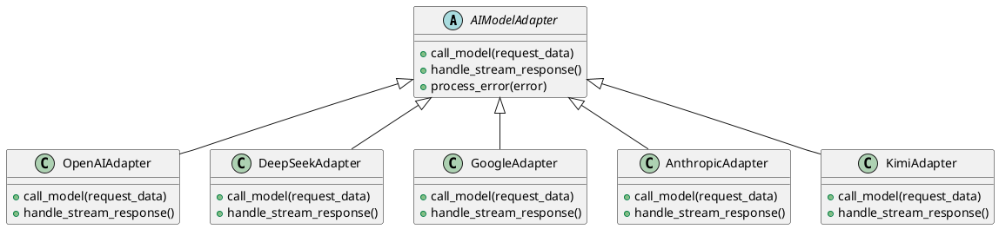

**统一调用流程**：
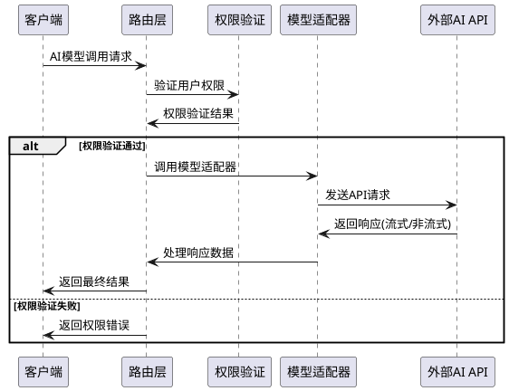

### 2.5 Token管理模块

**模块路径**：`routes/token_*.py`

**核心功能**：
- Token余额管理
- Token申请审批
- 使用记录统计
- 配额控制

**状态机设计**：
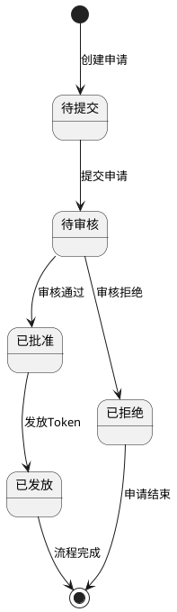

### 2.6 安全模块

**模块路径**：`routes/security/`

**核心功能**：
- 敏感信息脱敏
- 权限验证
- 访问控制
- 安全审计

**脱敏处理流程**：
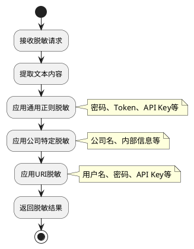

## 3. 工具模块设计

### 3.1 日志模块

**模块路径**：`utils/log.py`

**功能特性**：
- 分级日志记录
- 日志格式统一
- 日志轮转管理
- 性能监控

### 3.2 权限工具模块

**模块路径**：`utils/permission_utils.py`

**核心函数**：
```python
def common_model_user_permission(user_name: str) -> bool:
    """通用模型用户权限检查"""
    
def check_repo_permission(user_name: str, repo_name: str) -> bool:
    """仓库权限检查"""
    
def no_permission_response(model_name: str) -> dict:
    """无权限响应生成"""
```

### 3.3 配置管理模块

**模块路径**：`config.py`, `config_cache.py`

**设计特点**：
- 环境分离配置
- 敏感信息加密
- 缓存配置管理
- 动态配置更新

## 4. 数据模型模块

### 4.1 模型关系图

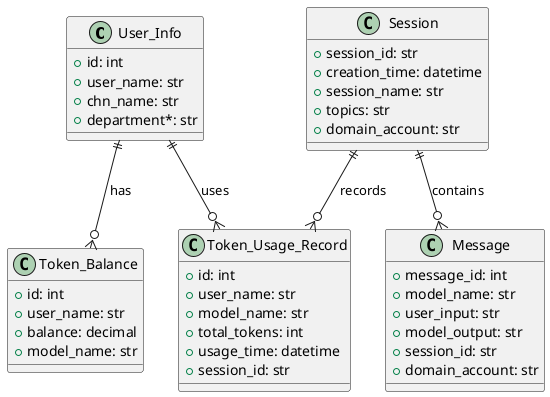

### 4.2 模型基类设计

```python
from models import db

class BaseModel:
    """数据模型基类"""
    
    def save(self):
        """保存模型实例"""
        db.session.add(self)
        db.session.commit()
        
    def delete(self):
        """删除模型实例"""
        db.session.delete(self)
        db.session.commit()
        
    def to_dict(self):
        """转换为字典格式"""
        return {c.name: getattr(self, c.name) for c in self.__table__.columns}
```

## 5. 缓存模块设计

### 5.1 缓存策略

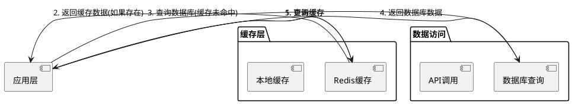

### 5.2 缓存配置

```python
class CacheConfig:
    CACHE_TYPE = 'redis'
    CACHE_REDIS_HOST = 'localhost'
    CACHE_REDIS_PORT = 6379
    CACHE_REDIS_DB = 0
    CACHE_DEFAULT_TIMEOUT = 300  # 5分钟默认过期时间
```

## 6. 通知模块设计

### 6.1 通知系统架构

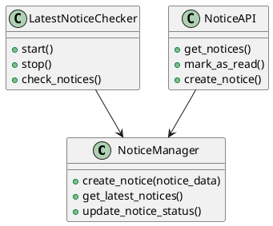

### 6.2 定时任务设计

```python
class LatestNoticeChecker:
    """最新通知检查器"""
    
    def __init__(self, app):
        self.app = app
        self.scheduler = None
        
    def start(self):
        """启动定时检查"""
        # 实现定时任务逻辑
        
    def check_notices(self):
        """检查最新通知"""
        # 实现通知检查逻辑
```

## 7. 文件服务模块

### 7.1 文件上传流程

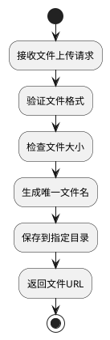

### 7.2 文件服务API

```python
@upload_to_server_bp.route('/upload', methods=['POST'])
def upload_file():
    """文件上传接口"""
    # 实现文件上传逻辑
    pass

@upload_to_server_bp.route('/files/<filename>')
def get_file(filename):
    """文件获取接口"""
    # 实现文件获取逻辑
    pass
```

## 8. 模块间通信

### 8.1 事件驱动架构

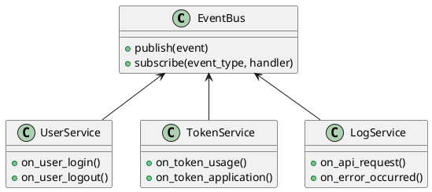

### 8.2 依赖注入

```python
class ServiceContainer:
    """服务容器"""
    
    def __init__(self):
        self._services = {}
        
    def register(self, name, service):
        """注册服务"""
        self._services[name] = service
        
    def get(self, name):
        """获取服务"""
        return self._services.get(name)
```

## 9. 模块测试设计

### 9.1 单元测试结构

```
tests/
├── test_models/          # 数据模型测试
├── test_routes/          # 路由功能测试
├── test_utils/           # 工具函数测试
├── test_integration/     # 集成测试
└── fixtures/             # 测试数据
```

### 9.2 测试覆盖率要求

- **单元测试覆盖率**：≥80%
- **集成测试覆盖率**：≥70%
- **API测试覆盖率**：100%

## 10. 模块部署与监控

### 10.1 模块健康检查

```python
@app.route('/health')
def health_check():
    """系统健康检查"""
    checks = {
        'database': check_database_connection(),
        'cache': check_cache_connection(),
        'external_apis': check_external_apis()
    }
    return jsonify(checks)
```

### 10.2 性能监控

- **响应时间监控**：每个模块的平均响应时间
- **错误率监控**：模块错误发生频率
- **资源使用监控**：CPU、内存使用情况
- **依赖服务监控**：数据库、缓存、外部API状态