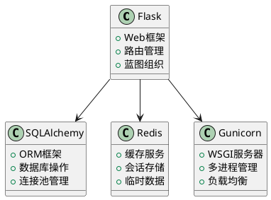
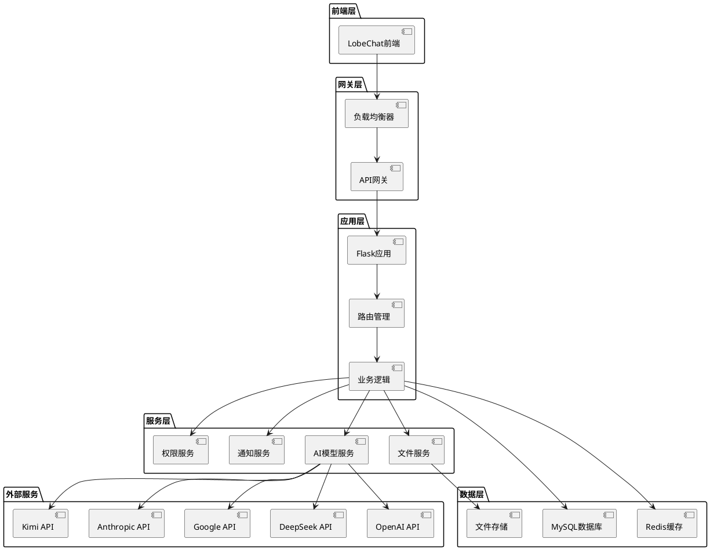
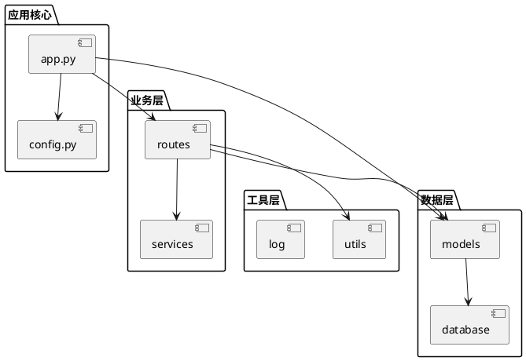
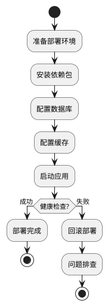

# LobeChatService 项目架构设计文档

## 1. 项目概述

LobeChatService是一个基于Flask的AI聊天服务后端系统，为LobeChat前端应用提供完整的后端服务支撑。该系统整合了多个主流AI模型提供商，提供统一的API接口，支持多用户、多会话的智能对话服务。

### 1.1 核心功能
- **多AI模型集成**：支持OpenAI、DeepSeek、Google、Anthropic、Kimi等多个AI模型
- **用户管理**：完整的用户信息管理和权限控制体系
- **会话管理**：支持多会话并发，会话状态持久化
- **消息处理**：完整的消息生命周期管理
- **Token管理**：Token余额、申请、使用记录的完整管理
- **安全防护**：敏感信息脱敏，权限验证
- **文件服务**：图片上传和处理服务
- **通知系统**：系统通知和公告管理
- **数据追踪**：用户行为和系统运行数据追踪

### 1.2 技术特点
- **微服务化设计**：模块化的路由和服务组织
- **多模型适配**：统一的AI模型调用接口
- **高并发支持**：连接池和缓存机制
- **实时通信**：支持流式响应
- **数据持久化**：完整的数据存储和管理

## 2. 技术架构

### 2.1 技术栈



### 2.2 系统架构



## 3. 模块架构

### 3.1 应用结构

```
LobeChatService/
├── app.py                      # Flask应用入口
├── config.py                   # 配置管理
├── config_cache.py            # 缓存配置
├── run.py                     # 应用启动
├── models/                    # 数据模型
│   ├── __init__.py
│   ├── user_info.py          # 用户信息模型
│   ├── session.py            # 会话模型
│   ├── message.py            # 消息模型
│   ├── token_*.py            # Token相关模型
│   └── ...
├── routes/                    # 路由模块
│   ├── sessions.py           # 会话管理
│   ├── messages.py           # 消息处理
│   ├── open_ai_ecosystem_api/ # AI模型集成
│   ├── user_permission/      # 用户权限
│   ├── security/             # 安全模块
│   └── ...
├── utils/                     # 工具模块
│   ├── log.py               # 日志工具
│   ├── permission_utils.py  # 权限工具
│   ├── constant.py          # 常量定义
│   └── ...
└── doc/                      # 设计文档
```

### 3.2 模块依赖关系



## 4. 核心组件设计

### 4.1 Flask应用工厂

```python
def create_app(config=None):
    app = Flask(__name__)
    # 配置初始化
    # 数据库初始化  
    # 缓存初始化
    # 蓝图注册
    # CORS配置
    return app
```

### 4.2 蓝图组织

系统采用蓝图(Blueprint)模式组织路由，主要蓝图包括：

- `users_bp`: 用户管理 (`/api/users`)
- `sessions_bp`: 会话管理 (`/api/sessions`) 
- `messages_bp`: 消息处理 (`/api/messages`)
- `open_ai_bp`: OpenAI集成 (`/api/open_ai`)
- `deepseek_bp`: DeepSeek集成 (`/api/deepseek`)
- `google_bp`: Google集成 (`/api/google`)
- `anthropic_bp`: Anthropic集成 (`/api/anthropic`)
- `kimi_bp`: Kimi集成 (`/api/kimi`)
- `token_*_bp`: Token管理相关
- `security_bp`: 安全模块 (`/api/security`)

### 4.3 数据库连接池配置

```python
class Config:
    SQLALCHEMY_POOL_SIZE = 500           # 连接池大小
    SQLALCHEMY_MAX_OVERFLOW = 10         # 最大溢出连接数
    SQLALCHEMY_TRACK_MODIFICATIONS = False
```

## 5. 部署架构

### 5.1 部署流程



### 5.2 容器化部署

项目支持Docker容器化部署：

```dockerfile
FROM python:3.9-slim
WORKDIR /app
COPY requirements.txt .
RUN pip install -r requirements.txt
COPY . .
EXPOSE 8000
CMD ["gunicorn", "-c", "gunicorn.conf.py", "app:application"]
```

## 6. 扩展性设计

### 6.1 AI模型扩展

系统设计了统一的AI模型接口，新增模型只需：
1. 在`routes/open_ai_ecosystem_api/`下创建新的模型路由文件
2. 实现统一的API调用接口
3. 在`app.py`中注册新的蓝图

### 6.2 功能模块扩展

新增功能模块的标准流程：
1. 在`models/`下定义数据模型
2. 在`routes/`下创建路由文件
3. 在`utils/`下添加工具函数
4. 在`app.py`中注册蓝图

## 7. 性能优化

### 7.1 数据库优化
- 连接池配置优化
- 查询索引优化
- 批量操作优化

### 7.2 缓存策略
- Redis缓存热点数据
- 会话状态缓存
- API响应缓存

### 7.3 并发处理
- Gunicorn多进程部署
- 异步请求处理
- 流式响应优化

## 8. 监控与日志

### 8.1 日志系统
- 统一的日志格式
- 分级日志记录
- 日志轮转机制

### 8.2 监控指标
- API响应时间
- 数据库连接池状态
- 缓存命中率
- 错误率统计